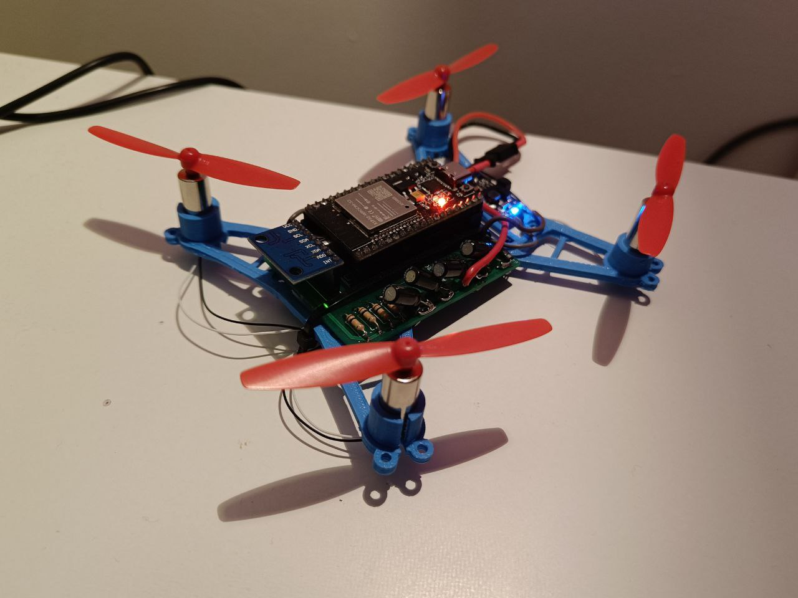

# ESP32-miniQuadCopter

### What's this?
This project had the initial goal of creating a very small quadcopter drone piloted through a web interface built from scratch under 40€. 

This proved doable but annoying as we got bogged down in figuring out the proper electronics. We managed this after a lot of work, but by then enthusiasm for the project was quite low. 

_Alas, the web interface part remains thus undone_. We might pick this project back up later down the line but no guarantees.

**Still, we wanted to publish this to shorten the work of anyone who had a similar idea.** 

Check the subfolders for the instructions and files you'll need.

(_Check out https://github.com/joshuasrcho/ESP32-Quadcopter who has made a much more complete, if more complex, version of the same concept. We only found out about it halfway through :/_ )

