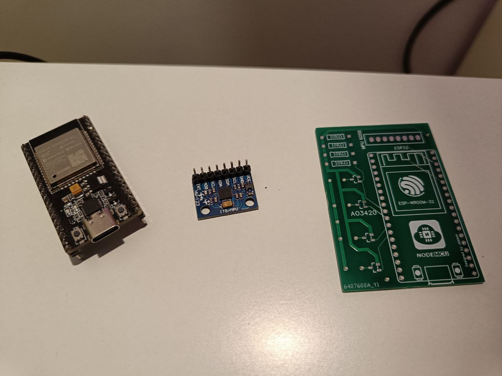
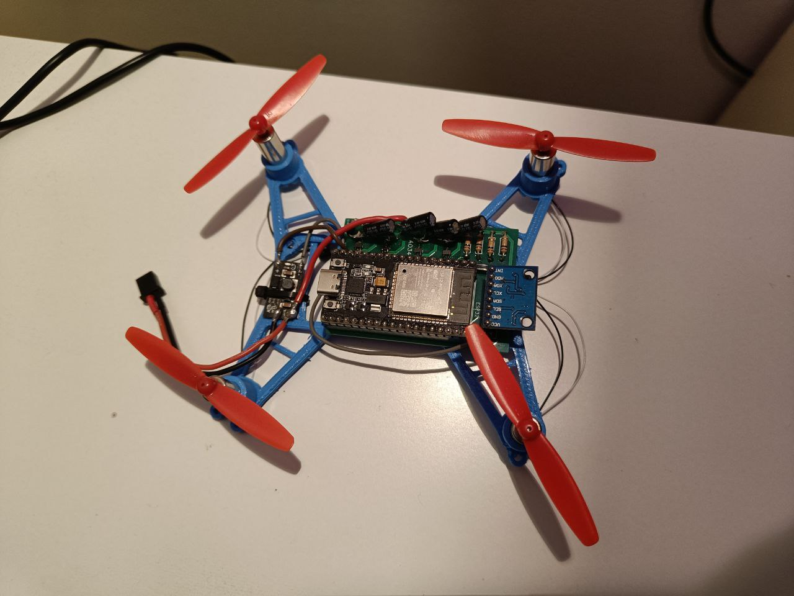
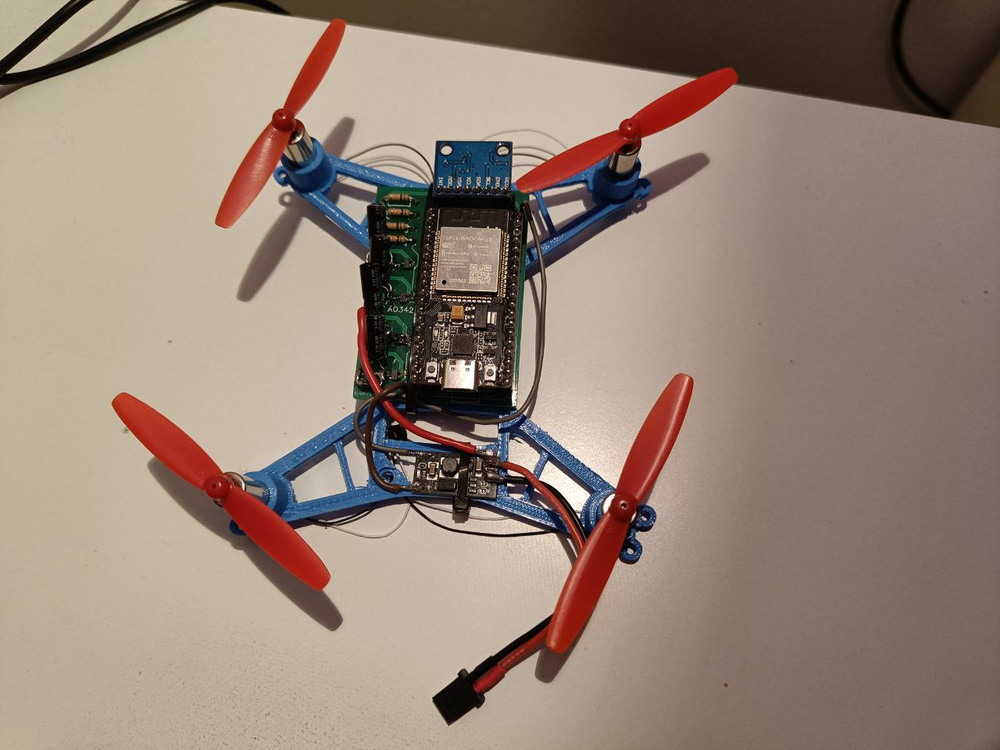
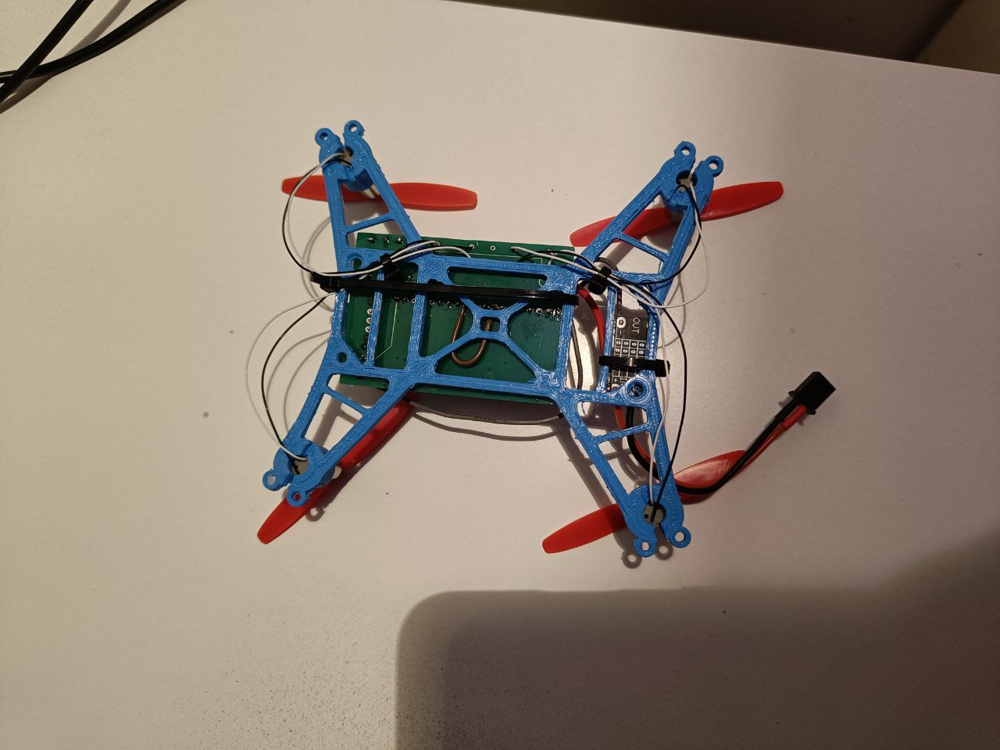

# Making the drone

### Step 1: Print the frame
Print the included .stl file.

### Step 2: Print the PCB
The file was generated with the editor from https://jlcpcb.com/ and printed by the very same company. It is very simple and as such very cheap. You can print your own or solder the wires yourself if you have the patience.

The PCB and main components you'll need.
### Step 3: Gather and solder the necessary components.
Some exact specs are included but all components should be interchangeable with equivalents.
- ESP32 (The one used in our build was an Adafruit ESP32 Feather)
- MPU6050 IMU
- AO3420 MOSFET x4
- 16v 100μF capacitor x4
- 10kΩ resistance x4
- diodes x4
- detachable connectors (optional)

- 8520 DC 3.7v Coreless motors and compatible props x4
- JST connectors and lipo battery (tested with 300mAh 120C )

## Wiring from our latest prototype:

